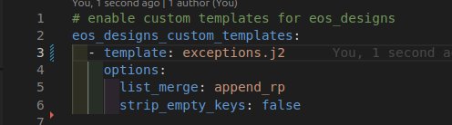
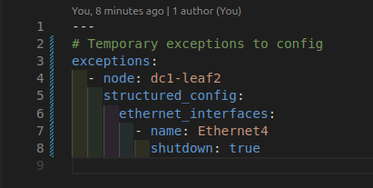
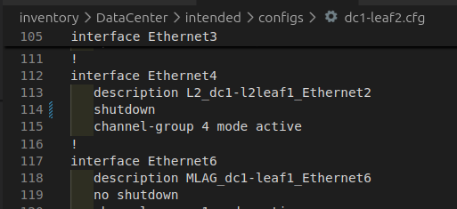

# Exceptions custom template

This template can be used to handle temporary exceptions in a central location instead of using node_type structured_config or host_vars.
Example: temporarily shutting down a port in a port-channel due to flapping

Use the following data model:
```
exceptions:  <list of dict>
  - node: <str; required; unique; must match the inventory_hostname entry>
    structured_config: <dict; use eos_cli_config_gen>
```

Documentation: https://avd.arista.com/5.5/ansible_collections/arista/avd/roles/eos_designs/docs/how-to/custom-templates.html

## How to use

1- copy the template file in a valid location
```
<path to users AVD implementation>/playbooks/templates/templates/<template name>
<path to users AVD implementation>/playbooks/templates/<template name>
<path to users AVD implementation>/playbooks/<template name>
```
2- enable the template in eos_desings



3- set the variable in a valid ansible location (ex: inventory file, group_vars, host_vars...)



4- run the AVD build (eos_desings role)

5- rendrered configuration



## Note
Tested with AVD 4.x and 5.x