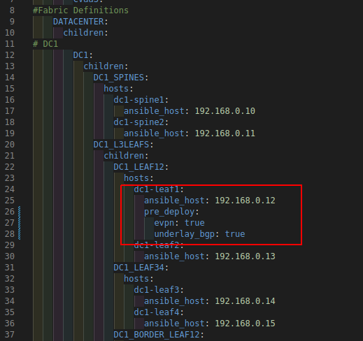
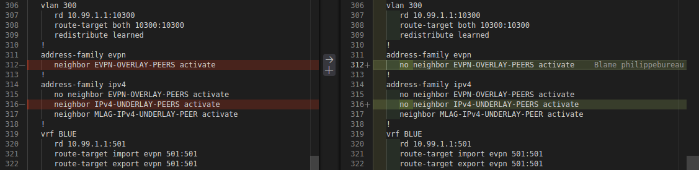

# Pre Deploy custom template

This template can be used for a VTEP in early deployment steps.
It can prevent underlay BGP peering and / or EVPN peering so basic validations can be done (ex: uplinks and MLAG )
Use the following data model:
```
pre_depoy:
  evpn: bool   # disable evpn peering
  underlay_bgp: bool   # disable bgp peering with spines
```

Documentation: https://avd.arista.com/4.10/roles/eos_designs/docs/role-configuration.html#custom-templates

## How to use

1- set the variable in a valid ansible location (ex: inventory file, group_vars, host_vars...)


2- run the AVD build (eos_desings role)

3- outcome


## Note
Tested with AVD 4.x and 5.x