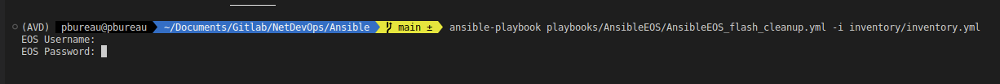
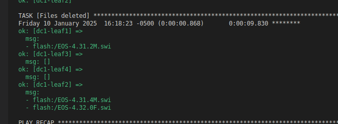

# AnsibleEOS_flash_cleanup playbook

## This playbook will "cleanup" the EOS device flash by removing all EOS images not currently used to boot

## requirements
| requirement | installation instructions |
| ---- | ------------------------- |
| ansible-core | pip install ansible-core |
| arista.eos ansible collection | ansible-galaxy collection install arista.eos |

## to run
```
ansible-playbook playbooks/AnsibleEOS/AnsibleEOS_flash_cleanup.yml -i inventory/inventory.yml
```
>note: This example is when running from the Ansible directory

At execution, the playbook will request to provide username and password to access the EOS devices


When completed, the terminal output for the task called `Files deleted` will show what file have been deleted on each device
