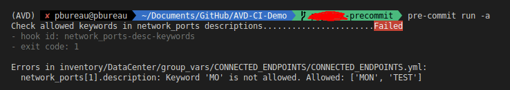

# Interface description tag check
This hook allows to check for specific tags that you want to allow to be used in AVD `network_ports` data-model.

Set the allowed tags in a YAML file and provide the file path to the hook in `.pre-commit-config.yml` 

> example: 
> ```yaml
> allowed_keywords:
>   - "MON"
>   - "TEST"
>   - "PROD"
> ```

## Hook configuration example

```yaml
repos:
  - repo: local
    hooks:
      - id: network_ports-desc-keywords
        name: Check allowed keywords in network_ports descriptions
        entry: pre_commit_hooks/pre_commit_network_ports_desc.py
        language: python
        types: [yaml]
        files: inventory/DataCenter/group_vars/CONNECTED_ENDPOINTS/CONNECTED_ENDPOINTS.yml
        additional_dependencies: [pyyaml]
        args: ["--allowed_list", "pre_commit_hooks/keyword_list.yml"]

```
>note: the args parameter list value must start with `--allowed_list` followed by the file path as per the example above.

>note2: the `files` parameter can use regex matching ex: `inventory/(DataCenter|MPLS)/(group_vars/|host_vars/)`


## output example

script value:
`ALLOWED_KEYWORDS = [ "MON", "TEST" ]`

AVDvdata-model:
```yaml
network_ports:
  - switches: [ dc2-leaf1 ]
    switch_ports: [ Ethernet4 ]
    description: '[TEST]host dc2-host1 Et1'
    mode: access
    vlans: 100
  - switches: [ dc2-leaf2 ]
    switch_ports: [ Ethernet4 ]
    description: '[MO]host dc2-host1 Et2'
    mode: access
    vlans: 100
  - switches: [ dc2-leaf3 ]
    switch_ports: [ Ethernet4 ]
    description: '[MON] host dc2-host2 Et1'
    mode: access
    vlans: 200
  - switches: [ dc2-leaf4 ]
    switch_ports: [ Ethernet4 ]
    description: host dc2-host2 Et2
    mode: access
    vlans: 200
```


output:

